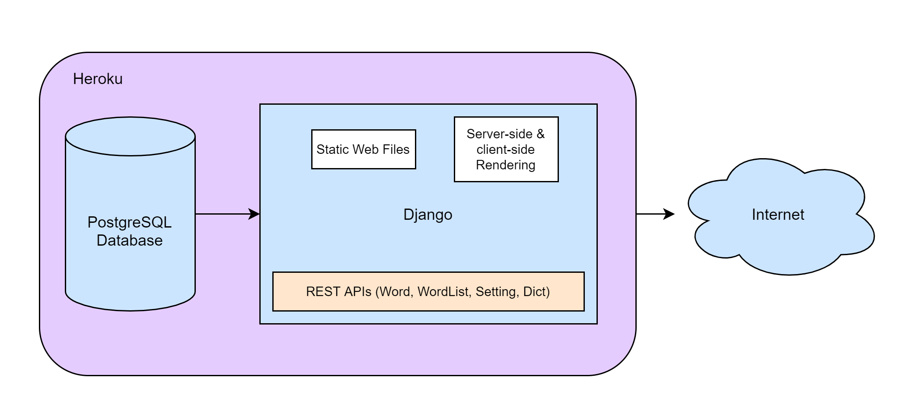
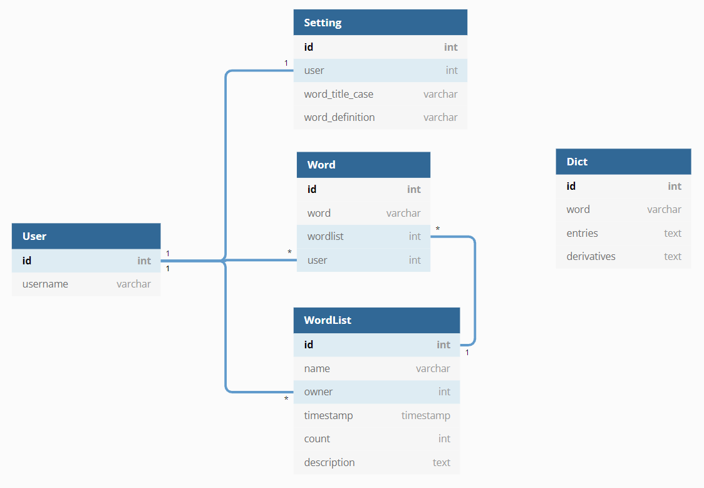

# Introduction

This portfolio demonstrates my full-stack web development skills, including HTML5, CSS3, JavaScript (ES6), Django, React, etc. It includes three personal projects. The vocabulary builder app and the job seeking app are hosted on Heroku. The web map app is hosted on AWS Amplify.

# Project 1 - Vocabulary Builder

My first app is a vocabulary builder web application. It contains two major components: a **frequency counter** to break down any given text and a **vocabulary lists system** to organize and review the saved words. Additionally, there is a Random Words page to play with any eight words from the server. A potential functionality is to add a spaced repetition tool be better memorize the desired words.

The reason I took CS50 Web Programming was because I wanted to create a customized vocabulary builder that satisfies my own needs. The vocabulary/dictionary applications I could find online are helpful in terms of single word, but they are not able to perform patch look-ups. I believe patch search will be extremely helpful when I read long articles online.

## How to run the app

This app is fairly easy to use:

- input a paragraph of text, and the results will be returned as a frequency table
- create new word lists, save words accordingly
- review the senses of words
- Notice: this project relies on an external Oxford API, and there is a [monthly limit (1000 calls)](https://developer.oxforddictionaries.com/FAQ#monthly_limits), please do not use a super long text for evaluation. Thank you.

## Distinctiveness and Complexity

The workflow of this project is as follows:

1. Users input a paragraph of text on the index page. When they hit the "Count Frequency" button, the page will show a result table on the right or at the bottom responsively depending on the size of the screen. At the same time, the numbers of distinct and total words will be displayed below the input text, providing some information about the text.

2. After the index page shows the results, users can save all of the distinct words to their desired word list if they've already logged in. They can learn about the meanings on vocabulary lists page. Words are displayed as cards on the page and their meta-information and meanings will be retrieved from server database. If the data of a specific word cannot be found in server database, an API call will be executed to fetch the relative data from [Oxford Dictionary API](https://developer.oxforddictionaries.com/) and save to local server for future uses. The "random words" page will fetch random words directly from server database.

3. When users created their accounts, a default word list will be automatically created for them. They can manage their lists in the settings page by creating new lists or deleting the existing ones.

## Architecture and Simplified Database schema

